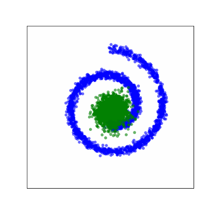
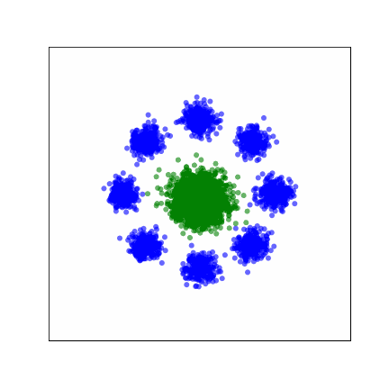
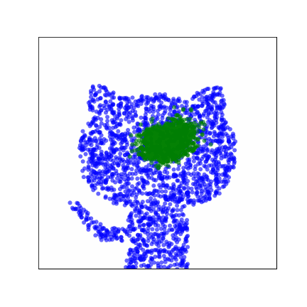
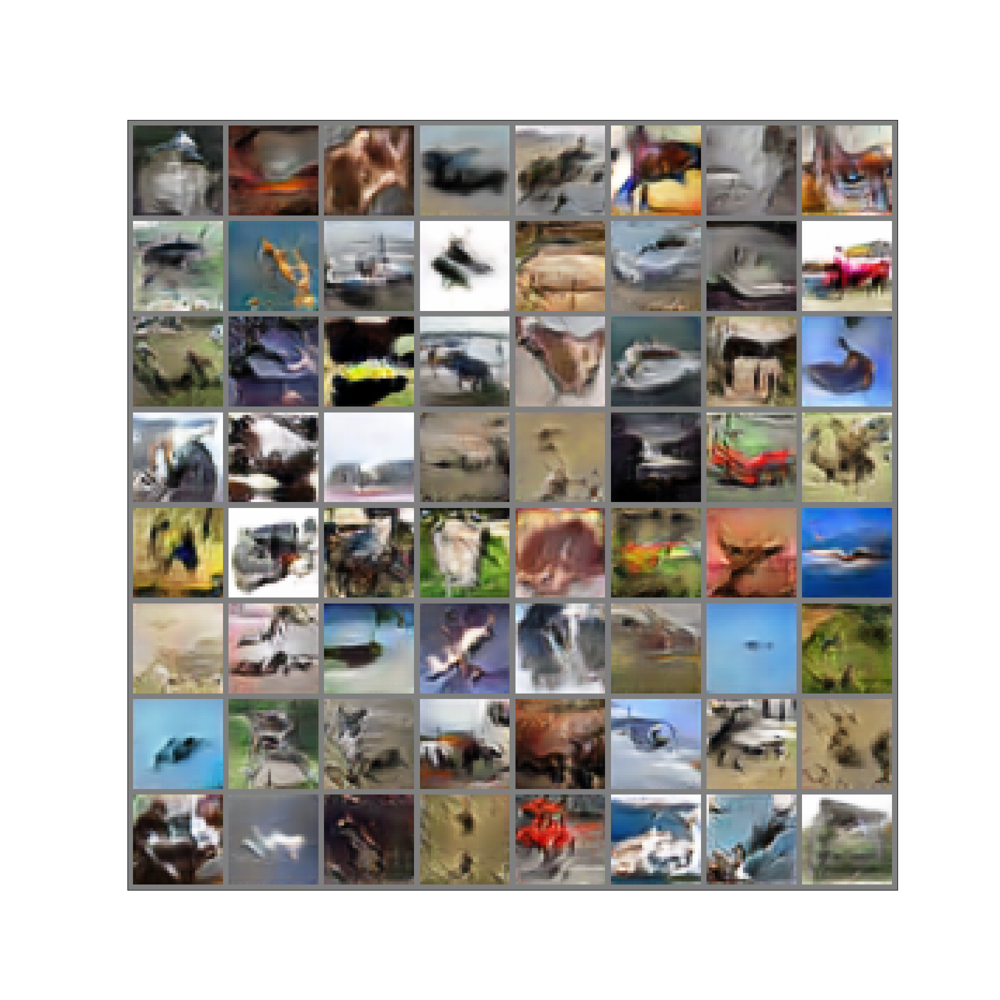

 # Learning with Stochastic Orders
This repository implements the algorithms and experiments described in [Learning with Stochastic orders](TODO_need_link).

## 0. Install
To get started, create and activate the `conda` environment below:
```shell
conda env create -f gmorder_env.yml
conda activate gmorder_env
```

Note, if installing this environment on macOS, remove the `cudatoolkits` dependency from [`gmorder_env.yml`](https://github.com/yair-schiff/stochastic-orders-ICMN/blob/f8b6e8d2dee74ce65fc5ceeb594a3dccb3f1911c/gmorder_env.yml#L8) as [CUDA no longer supports macOS](https://developer.nvidia.com/nvidia-cuda-toolkit-11_7_0-developer-tools-mac-hosts).
Additionally, for running generative modeling training on larger datasets, such as CIFAR-10, you will need to ensure that `device` is set to `cpu`, e.g., in [`run_wgan_train_images.sh`](https://github.com/yair-schiff/stochastic-orders-ICMN/blob/f8b6e8d2dee74ce65fc5ceeb594a3dccb3f1911c/run_wgan_train_images.sh#L14) and [`run_wgan_dominate_images.sh`](https://github.com/yair-schiff/stochastic-orders-ICMN/blob/f8b6e8d2dee74ce65fc5ceeb594a3dccb3f1911c/run_wgan_dominate_images.sh#L40).


## 1. Instructions to run 1D portfolio optimization
To run the 1D portfolio optimization experiment open and execute the [`portfolio_optimization`](notebooks/portfolio_optimization.ipynb) notebook.

## 2. Generative modeling with d<sub>CT</sub>
<p>
    
    
    
</p>

To run the GAN training using the Choquet-Toland (CT) distance use the shell script below:
```shell
sh run_choquet_train_distributions.sh
```
Open this script and change `data` ([Line 7](https://github.com/yair-schiff/stochastic-orders-ICMN/blob/f8b6e8d2dee74ce65fc5ceeb594a3dccb3f1911c/run_choquet_train_distributions.sh#L7)) to one of `circle_of_gaussians`, `swiss_roll`, `image_point_cloud`.

## 3. Baseline generator domination with VDC
<p>

</p>

|  | FID |
--|--
| g<sub>0</sub>: WGAN-GP | 69.67 |
| g<sup>*</sup>: WGAN-GP + VDC  | **67.317** ± 0.776 |

To train a baseline WGAN-GP model run
```shell
sh run_wgan_train_images.sh
```


Once training is complete, to reproduce the WGAN-GP + VDC results from the paper, execute:
```shell
sh run_wgan_dominate_images.sh
```
If needed, change file paths in this script to point to where the WGAN-GP checkpoint file and hyperparameter args are saved.

## Acknowledgements
For several of our generator, discriminator, and Choquet critics, we draw inspiration and leverage code from the following public GitHub repositories:
1. https://github.com/caogang/wgan-gp
2. https://github.com/ozanciga/gans-with-pytorch
3. https://github.com/CW-Huang/CP-Flow

## Citation:
To cite our work please use: TODO: need bibtex citation here
```
@article{name,
  title={Learning with Stochastic Orders},
  author={Domingo-Enrich, Carles and Schiff, Yair and Mroueh, Youssef},
  year={2022}
}
```
